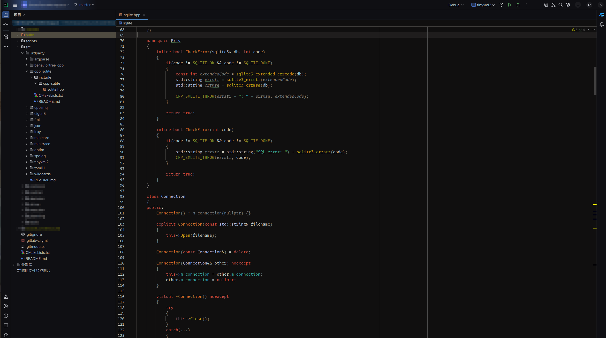

# 一个基于 Flexoki 配色的主题

一个非常简单的基于Flexoki配色的主题。

平常 cpp 使用较多，所以仅在 Clion 测试。

无开发类似插件经验，如果那里不合适欢迎提出，~~~虽然上班不一定能看到 ~~~

如果你觉得这个配色不错，并且具备完善的技术路线和时间，希望你能搞个更完善的出来，或者知道有更完善的也可以告诉我。

如果你觉得我弄得不错可以入您法眼，也可以打赏我 5 毛钱。

代办事项：

- [ ] 实现浅色方案   
- [ ] 优化深色，背景过于颜色过深实际体验并不友好

